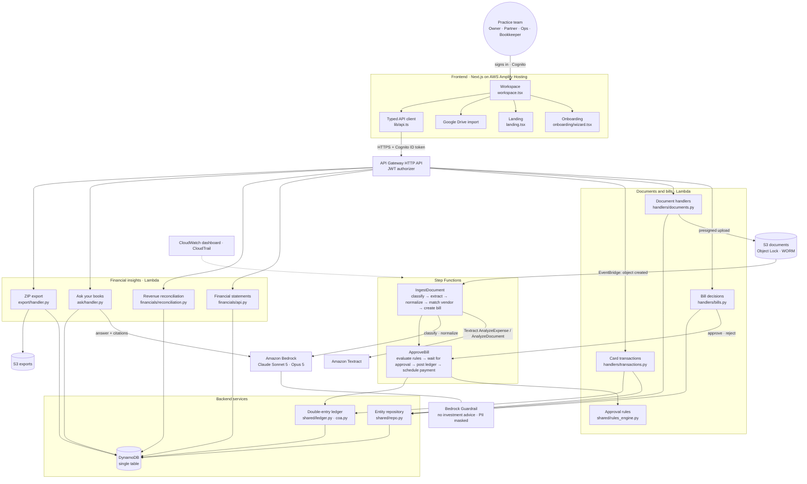

# Otter

**The AI back office for independent advisor practices.** Upload invoices, receipts and LPL payout statements; Otter reads them, routes bills through approval rules, reconciles payouts against the fee schedule, and keeps a live general ledger with financial statements, a practice valuation and plain-English answers with citations.

Built for the LPL Financial University Hackathon. All data is fictional (practice: **Harbor Point Wealth**).

---

## Open the live app

**🔗 https://main.d1ci8xrur0a8sr.amplifyapp.com**

Sign in with one of the demo accounts below. Each one is a different person at the practice, and the app shows only what that role is allowed to do (the backend enforces the same rules).

**Password for every demo account:** `Demo!2345` (demo user pool only; fictional data)

| Person | Email | Role | What they can do |
|---|---|---|---|
| **Maya Chen** | `maya@harborpoint.example` | Owner | Everything: dashboard, uploads, field review, rules, approvals (except bills she uploaded herself), owner-only hold overrides and voids |
| **Raj** | `raj@harborpoint.example` | Partner | Reviews and approves or rejects bills routed to the partner (e.g. over $1,000). No uploads, edits, imports or rule changes |
| **Dev** | `dev@harborpoint.example` | Operations | Uploads documents, reviews and confirms fields, marks goods received, imports card CSVs. **Can't approve** or change rules |
| **Priya** | `priya@lpl-demo.example` | LPL bookkeeper | Read-only: financials, bills, documents and card spend |

**Tip:** to demo an approval, sign in as **Dev** in one window to upload, and as **Raj** in a private/incognito window to approve. Nobody can approve a bill they uploaded (segregation of duties).

### Where things are

| Place | What's there |
|---|---|
| **Home** | Practice value, money in/out, margin, the **income statement, balance sheet and cash flow** (expense categories expand into sub-accounts, e.g. Travel → Airfare, Car rides, Ground transportation, Parking), recent bills, *Waiting on you* |
| **Money in** | Revenue reconciliation: expected fees vs. the LPL payout statement, with variance flags (e.g. a trail paid $412 short) |
| **Money out** | **Bills & approvals** (side-by-side invoice review, approve / reject / send back), **Card spend** (CSV import, auto-categorized, receipt matching), **Rules** (no-code approval rules) |
| **Documents** | Upload or import from Google Drive, review low-confidence extractions, vendors, export a ZIP package |
| **Ask** (button, bottom right) | Ask your books anything, e.g. *"Why did my margin drop in Q3?"*; answers cite the documents they came from |
| **⌘K** | Search, jump to any page, open a bill or document, or ask a question |

### Demo walkthrough (3 minutes)

Demo PDFs are in [`seed/docs/`](seed/docs).

1. **Dev** uploads `orion_invoice_450_2026-09-02.pdf` → recognized vendor, coded 6310 Software, auto-approved and scheduled.
2. **Dev** uploads `orion_invoice_1850_2026-09-12.pdf` → over $1,000, waits for the partner.
3. **Raj** opens it from *Waiting on you* → reviews the invoice side by side → **Approve** → posted to the ledger, payment scheduled (simulated).
4. **Dev** uploads `brightline_invoice_650_2026-09-18.pdf` → new vendor on hold for a W-9 and void check; uploading `brightline_w9.pdf` and `brightline_void_check.pdf` releases it automatically.
5. **Dev** uploads `lpl_payout_statement_sep_2026.pdf` → **Money in** flags the variable annuity trail on contract …4471: **$412 short**.
6. **Maya** shows **Home** (statements, breakdown, valuation) and **Ask** ("Why did my margin drop in Q3?" with citations), then **Export package**.

Reset between rehearsals (keeps history, removes demo uploads, card imports and September's payout):

```bash
cd backend
python scripts/reset_demo.py --table ledgerline-dev --practice p1            # preview
python scripts/reset_demo.py --table ledgerline-dev --practice p1 --execute  # apply
```

---

## Architecture



| Layer | AWS service | Why |
|---|---|---|
| Hosting & sign-in | Amplify Hosting, Cognito (groups: owner, partner, ops, lpl_bookkeeper) | Deploys from `main`; role comes from the ID token |
| API | API Gateway HTTP API + Lambda (Python 3.12, arm64) | Serverless, pay per request, JWT-authorized |
| Document AI | Textract, Bedrock (Claude), Step Functions, EventBridge | Purpose-built invoice extraction; auditable workflows |
| Approvals | Step Functions `waitForTaskToken` | Native human-in-the-loop approval |
| Records | S3 Object Lock | Tamper-proof books and records (SEC 17a-4 style) |
| Ledger | DynamoDB transactions | A journal is never half-written |
| Q&A safety | Bedrock Guardrails | No investment advice, PII masked |

---

## Repository layout

```
frontend/   Next.js app (Amplify): components/workspace.tsx, lib/api.ts, mocks/
backend/    AWS SAM: template.yaml, src/ (handlers, ingest, workflow, financials, ask, export, shared), statemachines/, tests/
backend/scripts/  seed.py, seed_ddb.py, seed_bills.py, reset_demo.py, demo_users.py, migrate_subledgers.py
seed/docs/  Watermarked demo PDFs ("SAMPLE — FICTIONAL DATA")
docs/       PRD, PLAN, TASKS, handoffs, Google Drive import guide
```

## Run the frontend locally

Requires Node.js 20.9+.

```bash
cd frontend
npm ci
npm run dev        # http://localhost:3000
```

Without configuration it runs on fictional mock data. To use the live backend, copy `frontend/.env.example` to `frontend/.env.local`, set `NEXT_PUBLIC_API_URL`, `NEXT_PUBLIC_COGNITO_USER_POOL_ID`, `NEXT_PUBLIC_COGNITO_CLIENT_ID` and `NEXT_PUBLIC_USE_MOCKS=false`, then restart. Live mode sends the Cognito **ID token** (`Authorization: Bearer <ID token>`). Google Drive import also needs `NEXT_PUBLIC_GOOGLE_CLIENT_ID`, `NEXT_PUBLIC_GOOGLE_API_KEY` and `NEXT_PUBLIC_GOOGLE_APP_ID` (see [docs/GOOGLE-DRIVE-IMPORT.md](docs/GOOGLE-DRIVE-IMPORT.md)). Hiding buttons is only a UI convenience; the backend enforces every permission.

## Deploy

- **Frontend:** Amplify Hosting builds automatically on every merge to `main` (app root `frontend`, root `amplify.yml`). `NEXT_PUBLIC_*` variables are set in Amplify and embedded at build time.
- **Backend:** AWS SAM stack `ledgerline-dev` in `us-east-1`. Build on Python 3.12 / arm64 (or `sam build --use-container`), keep the existing parameters, and review the change set before applying. Full setup, seeding and API contract: [backend/README.md](backend/README.md).

```bash
cd backend
sam build
sam deploy --stack-name ledgerline-dev --region us-east-1 --resolve-s3 \
  --capabilities CAPABILITY_IAM CAPABILITY_AUTO_EXPAND \
  --parameter-overrides Stage=dev DefaultPracticeId=p1 RetentionDays=1 ReviewConfidenceThreshold=0.8 \
    AllowSelfApproval=false BedrockModelId=anthropic.claude-opus-5 IngestModelId=us.anthropic.claude-sonnet-5
```

## Verify

```bash
cd backend && .venv/bin/pytest -q          # backend (moto, no AWS calls)
cd frontend && npm run typecheck && npm test && npm run build
```

## Compliance by design

Documents are stored write-once (S3 Object Lock) and never deleted, only dismissed. Every bill keeps a full audit trail. No bill posts without a rule pass or a human approval, and nobody approves their own upload. Extractions under 80% confidence go to a person. Ask cites its sources and is guarded against investment advice. Payments are simulated; no real money moves.
